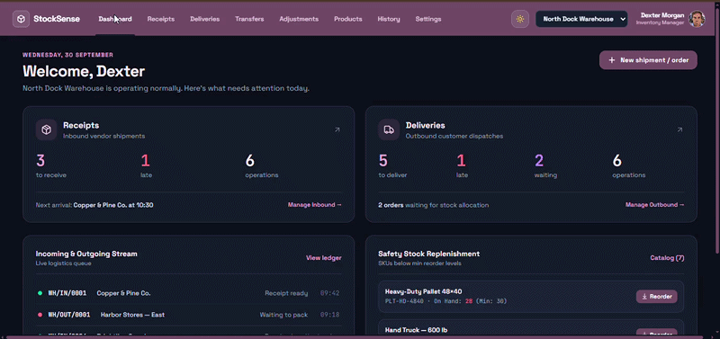
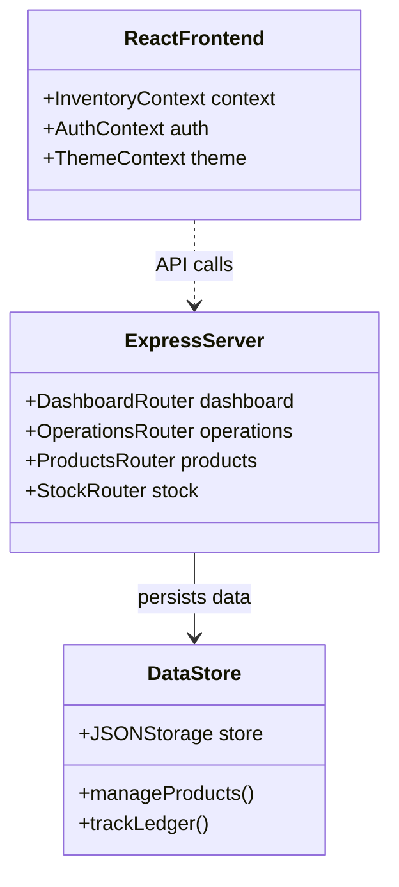
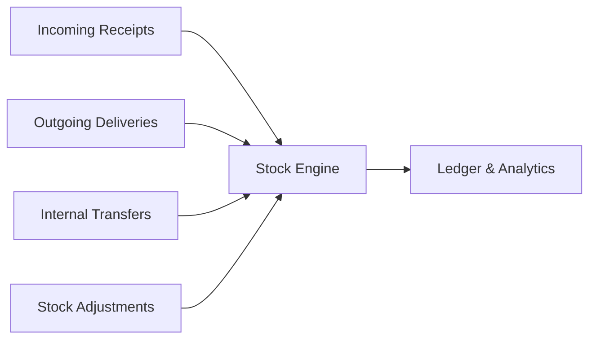

<div align="center">

# StockSense IMS

**Real-time inventory management system built with React, Vite, Tailwind CSS, and Node.js/Express | Powered by Google GenAI**

[](https://typescriptlang.org)
[](https://react.dev)
[](https://expressjs.com)
[](https://github.com/JEmmanuelAbishai/stocksense-ims/blob/main/LICENSE)

</div>

---

## Demo

<div align="center">


<div> The main dashboard showing real-time inventory KPIs and analytics </div>


</div>

---

## Overview

A modern Inventory Management System (IMS) designed to streamline stock tracking, warehouse operations, product cataloging, and ledger auditing. Built with a responsive React frontend and a robust Express backend service, it delivers real-time visibility into inventory flow.

**Domain:** Supply Chain & Inventory Management  
**Framework:** React 19, Vite, Tailwind CSS v4, Express, Lucide Icons  
**Status:** Active Development

---

## System Architecture

The architecture connects a Vite-powered React client with an Express backend server handling product catalogs, stock levels, and operations.



---

## Operations Pipeline

The backend manages multiple inventory operations including receipts, deliveries, transfers, and adjustments.



---

## Features

- **Real-time Analytics**: Comprehensive dashboard tracking inventory KPIs, stock levels, and operation trends.
- **Operations Management**: Handle receipts, deliveries, transfers, and stock adjustments with detailed modal views.
- **Product Catalog**: Manage stock locations, product attributes, and inventory thresholds.
- **Ledger Auditing**: Complete audit trail of all stock movements and ledger entries.

## Getting Started

```bash
# Install dependencies
npm install

# Run the development server
npm run dev
```

1. Open your browser and navigate to `http://localhost:3000`.
2. Use the interface to manage inventory, products, and operational logs.
3. (Or) Run the live link `https://ims-stocksense.vercel.app/`

## Authors & Contributors

| Name | Role | Key Contribution |
| :--- | :--- | :--- |
| [SiddarthReddyK](https://github.com/SiddarthReddyK) | Lead Developer / UI Designer | Responsive API & quick action triggers| 
| [suchith2510](https://github.com/suchith2510) | User Access / Product Managment | Integrate user authentication & warehouse configurations |
| [pranay339](https://github.com/pranay339) | Operations Integration | Focus on receipts and dispatches |
| [JEmmanuelAbishai](https://github.com/JEmmanuelAbishai) | Audit-Ledger Integration | Implement stock logging mechanism, along with phyiscal count |
```
